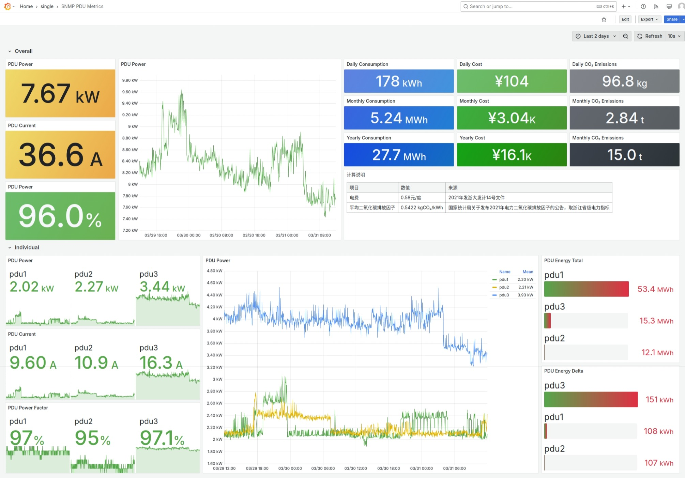
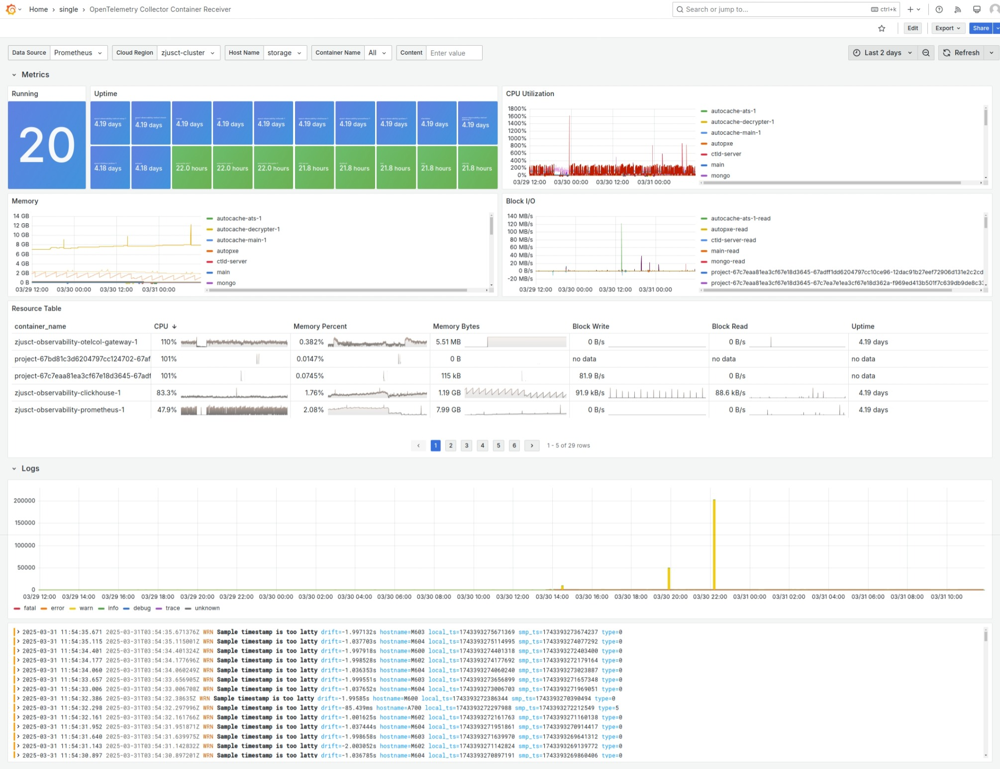
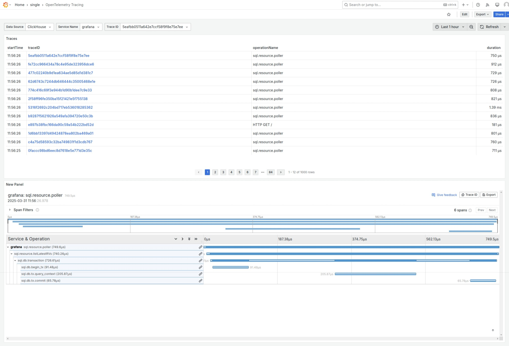
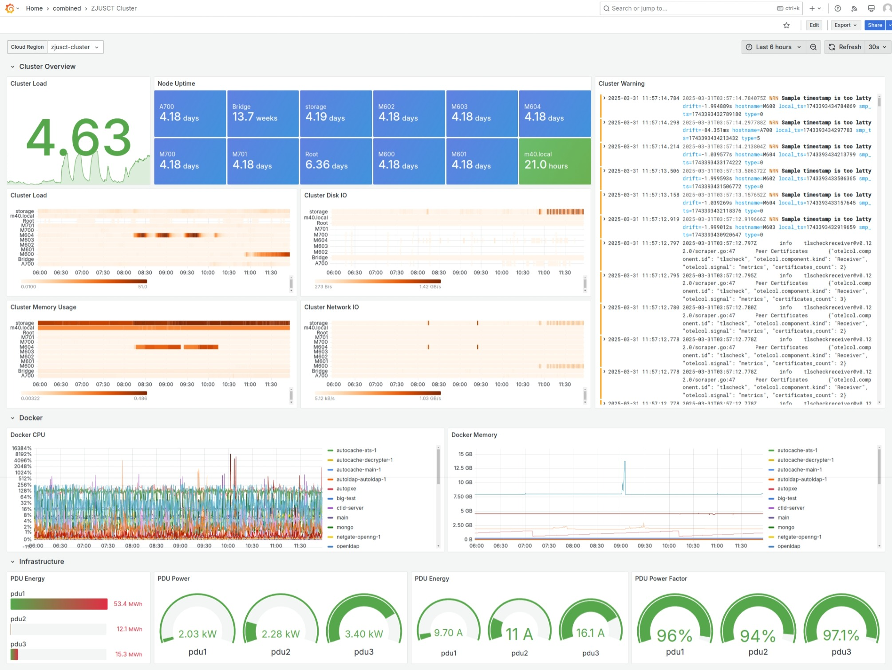
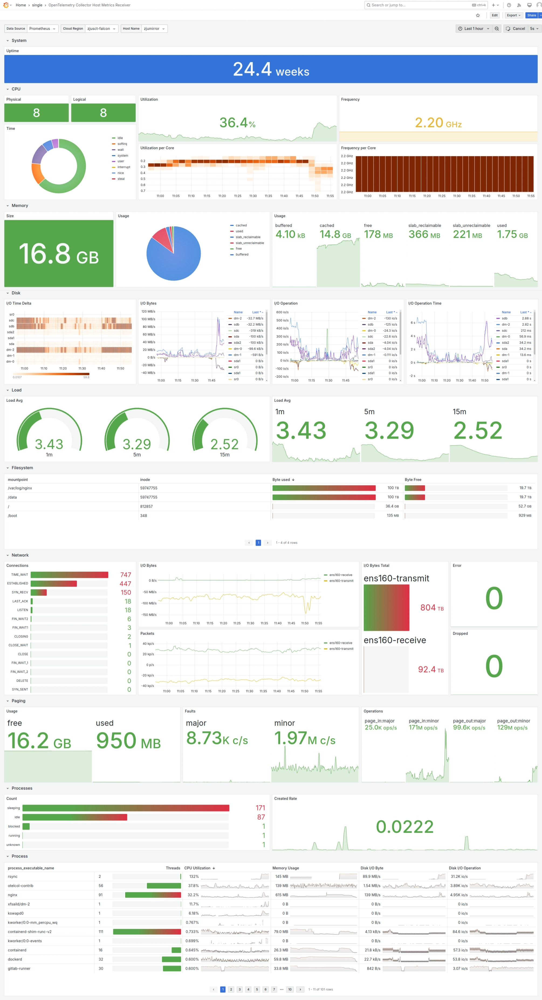
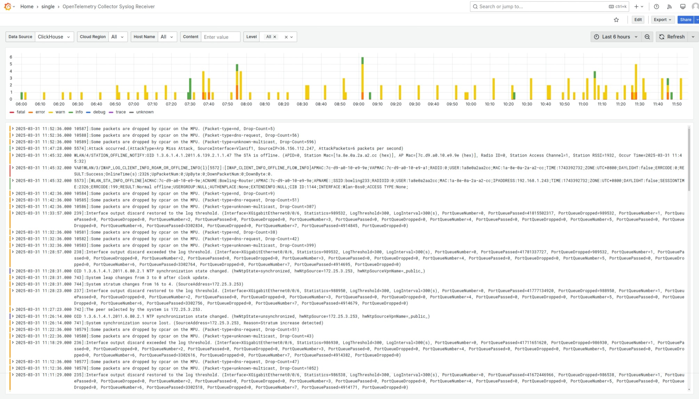
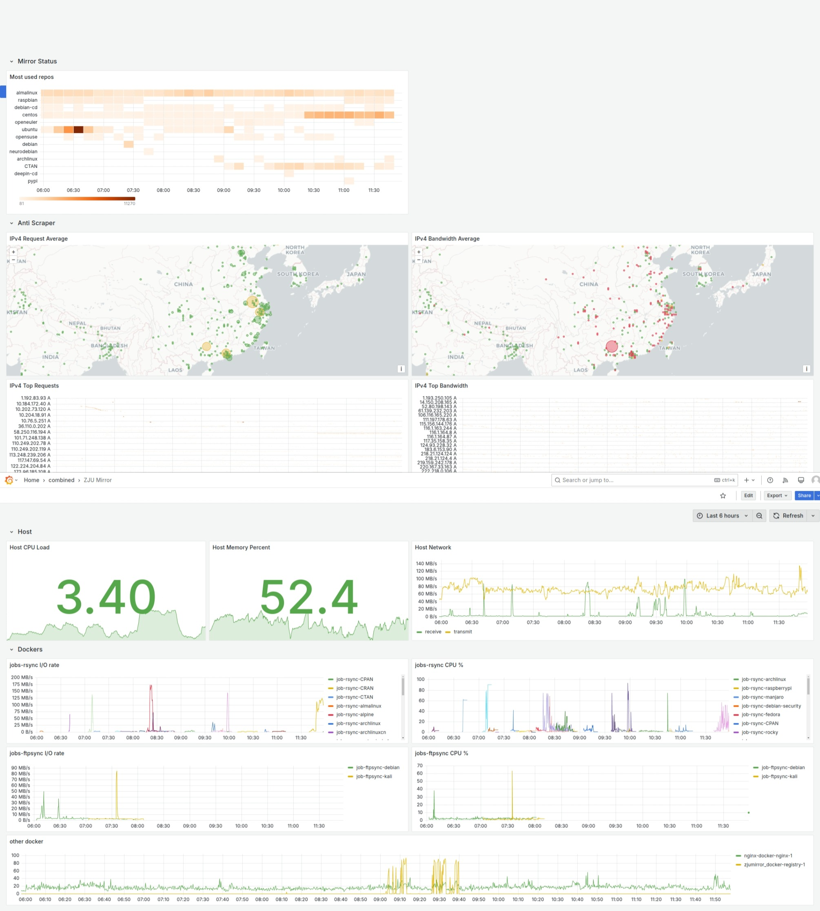
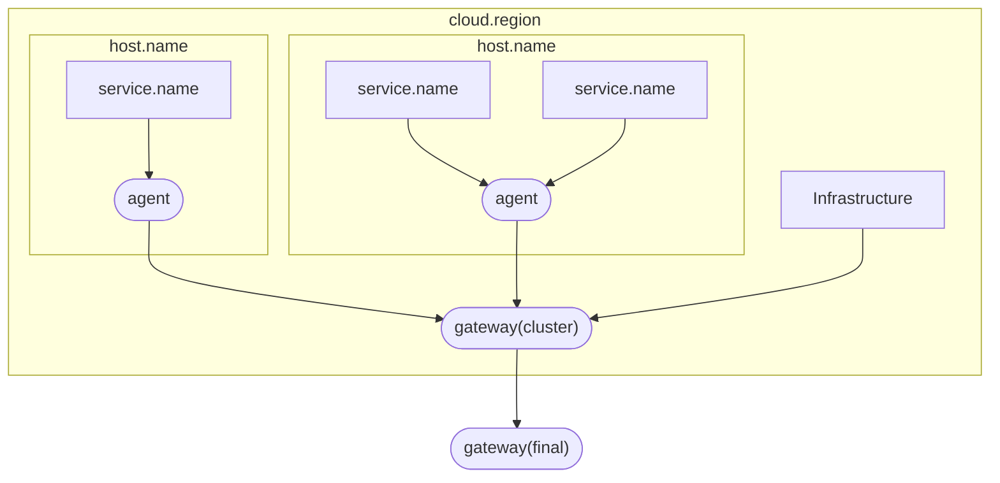

# grafana.clusters.zjusct.io

[中文 README](README_cn.md) | [English README](README.md)

[Observability - ZJUSCT OpenDocs](https://docs.zjusct.io/operation/observability/)

This repository contains configuration files for the ZJUSCT observability system.

## Demo

| pdu          | container      | netflow        | trace          |
| ------------ | -------------- | -------------- | -------------- |
|  |  |  |  |

| cluster      | hostmetrics    | syslog         | mirror |
| ------------ | -------------- | -------------- | -------------- |
|  |  |  |  |

## Todo List

- To be done
    - [ ] Grafana Provision Alerts
- Pending
    - [ ] InfluxDB Exporter
    - [ ] Journald attribute processing: Wait for [journald - Consider parsing more known fields from logs · Issue #7298 · open-telemetry/opentelemetry-collector-contrib](https://github.com/open-telemetry/opentelemetry-collector-contrib/issues/7298).

## Technology Stack

We ❤️ Open Source

| Layer | Components |
| --- | --- |
| Data Collection | [OpenTelemetry Collector](https://github.com/open-telemetry/opentelemetry-collector) |
| Data Storage | [ClickHouse](https://github.com/ClickHouse/ClickHouse), [InfluxDB](https://github.com/influxdata/influxdb), [Prometheus](https://github.com/prometheus/prometheus) |
| Data Analysis, Visualization and Alerting | [Grafana](https://github.com/grafana/grafana) |

The overall system design follows the KISS (Keep It Simple, Stupid) principle, simplifying the complexity of interactions between layers and reducing the difficulty of system maintenance.

## Data State

For ease of operations management, the system state should be completely determined by configuration files in the repository, with Docker being stateless. Data that needs to be persisted is stored locally using Docker Volumes.

- **Configuration files**: Simple text files that can be managed using Git, stored in this repository. With these configuration files, we only need to clone the repository and run `docker compose up` to quickly deploy the entire system, ready to use out of the box.

    Some services store configurations in databases, such as Grafana, which uses built-in SQLite 3 to store configurations, users, dashboards, and other data. Nevertheless, it provides [Provisioning](https://grafana.com/docs/grafana/latest/administration/provisioning/) functionality to initialize various configurations via configuration files. InfluxDB is more extreme, as its automatic token generation mechanism prevents configuration files from completely determining its state.

- **Database**: Service databases need persistent storage. Docker officially recommends using Volumes to store write-intensive data like databases.

    > Use volumes for write-heavy workloads: Volumes provide the best and most predictable performance for write-heavy workloads. This is because they bypass the storage driver and do not incur any of the potential overheads introduced by thin provisioning and copy-on-write. Volumes have other benefits, such as allowing you to share data among containers and persisting even when no running container is using them.

    To achieve out-of-the-box functionality, the Volumes in `compose.yml` all use relative paths, and the Git repository maintains the empty folder structure of `database`.

## Security

Four access scopes are distinguished:

| Area | Trust Level | Exposed Services |
| --- | --- | --- |
| Docker internal, host machine | Communication managed by Docker Engine, fully trusted | All |
| Cluster internal | Good security status, no TLS encryption required | Services with no authentication or weak authentication, such as syslog, snmp |
| Campus network | TLS encryption required, authentication required | Only otel-collector and Grafana |
| Public network | Blocked | None |

Authentication tokens are hosted in the cluster's VaultWarden. They are set as environment variables in `compose.yml`, with the `.env` file generated using the `get_credential.sh` script and read by Docker Compose. The `.env` file should not be committed to the Git repository.

## Details

### OpenTelemetry

Collector is deployed in the **Agent + Gateway mode**. In this mode, agents are responsible for data collection as much as possible, with more transformation and processing logic handled by the gateway. **Resource Attributes** are used to identify entities that generate data, and are attached by Collectors at different levels. Dividing data sources into hierarchical structures through resource attributes facilitates data analysis in Grafana.

Below are resource attributes and their sources in the ZJUSCT observability system, based on Semantic Conventions 1.28.0:

- Node agent

    - Node's own resource attributes

        | Resource Attribute | Source | Notes |
        | --- | --- | --- |
        | [Node `host.name`](https://opentelemetry.io/docs/specs/semconv/resource/host/) and [System `os.*`](https://opentelemetry.io/docs/specs/semconv/resource/os/) | `resourcedetector` | **Automatically added** in the pipeline |

    - Services running on nodes can be roughly divided into two categories: processes and containers.

    | Resource Attribute | Source | Notes |
    | --- | --- | --- |
    | [Process and runtime `process.*`](https://opentelemetry.io/docs/specs/semconv/resource/process/) | Not mandatory | - |
    | [Service `service.name`](https://opentelemetry.io/docs/specs/semconv/resource/#service) | `journaldreceiver` | **Using Operator to extract** the `SYSLOG_IDENTIFIER` field |
    | | `filelogreceiver` | **Using Operator to add**. Generally manually added (files rarely contain service names) |
    | [Container `container.name`](https://opentelemetry.io/docs/specs/semconv/resource/container/) | `dockerstatsreceiver` | **Automatically added** |
    | | `filelogreceiver` | **Using Operator to extract** fields from Docker JSON logs, requires modification of Docker `daemon.json` |

- Cluster gateway

    | Resource Attribute | Source | Notes |
    | --- | --- | --- |
    | [Cluster `cloud.region`](https://opentelemetry.io/docs/specs/semconv/resource/cloud/) | **Manually added** in the pipeline | Currently, OTel does not define a true "cluster" resource attribute, so we temporarily use cloud service information `cloud.*` instead. In simple cross-cluster deployments without a dedicated cluster gateway, `cloud.region` needs to be added to the agent. |
    | [Device `device.*`](https://opentelemetry.io/docs/specs/semconv/resource/device/) | - | We primarily use device attributes to represent infrastructure (routers, switches, smart PDUs, etc.), distinct from nodes. - `device.id` - `device.type` |
    | | `syslogreceiver` | **Using Operator to extract** the `hostname` field. |

Apart from the above resource attributes and basic format parsing like JSON, agents should avoid performing other processing as much as possible. This facilitates deployment (main changes occur in the gateway) and keeps agents lightweight, reducing resource consumption at the edge.

### Grafana

Based on the data sources, resource attributes, and OpenTelemetry semantic specifications mentioned above, we have created a series of Grafana dashboards, stored in the [`config/grafana/provisioning/dashboards`](config/grafana/provisioning/dashboards) directory:

- `zjusct/single`: Panel collections designed for a single type of data (such as a specific Receiver and storage backend combination), which can be easily incorporated into dashboards.
- `zjusct/combined`: Dashboards combining multiple data sources, for more specific application scenarios.

Since Grafana data is not persistent, dashboard backups should be considered when removing the Grafana Docker container. We use [esnet/gdg: Grafana Dashboard Manager](https://github.com/esnet/gdg) for batch dashboard backups.

Many sites offer public dashboards, and we've referenced some of their designs:

- [Sentry Software](https://hws-demo.sentrysoftware.com/dashboards)

## Code Style

- Use the EditorConfig plugin. You can refer to the [.editorconfig](.editorconfig) file.
- Format SQL using the VSCode SQLTools plugin.
