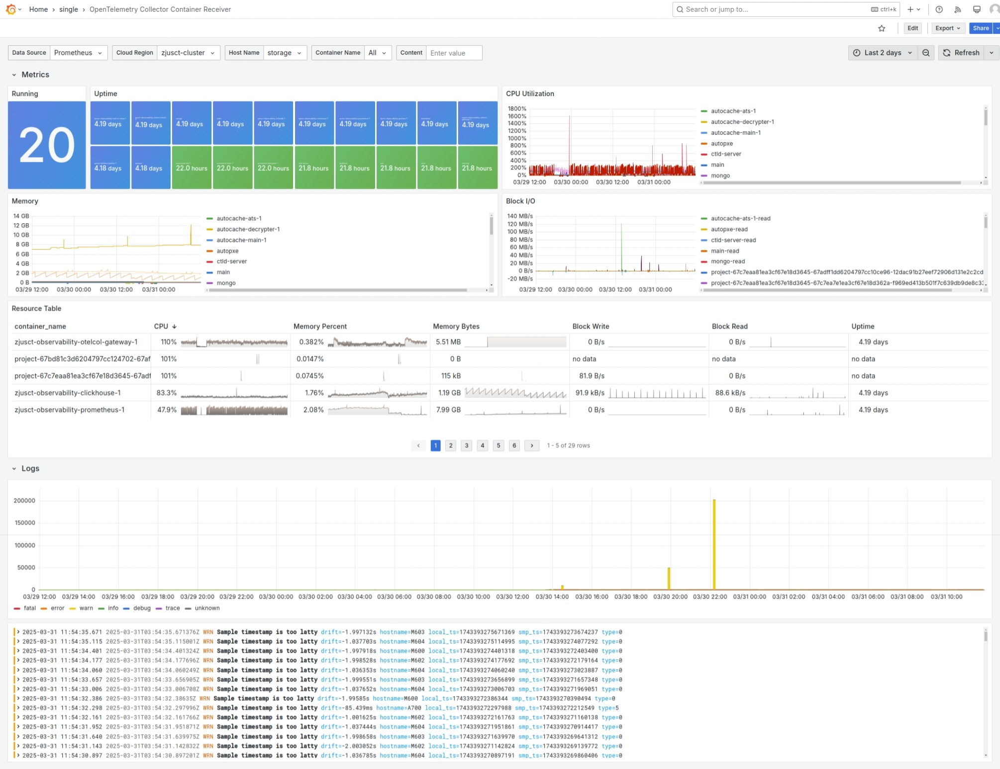
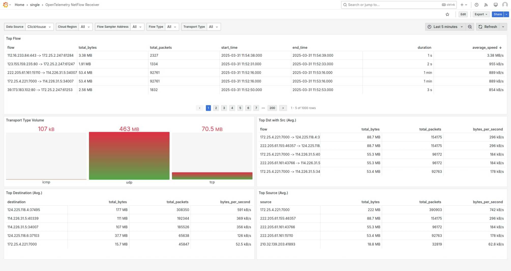
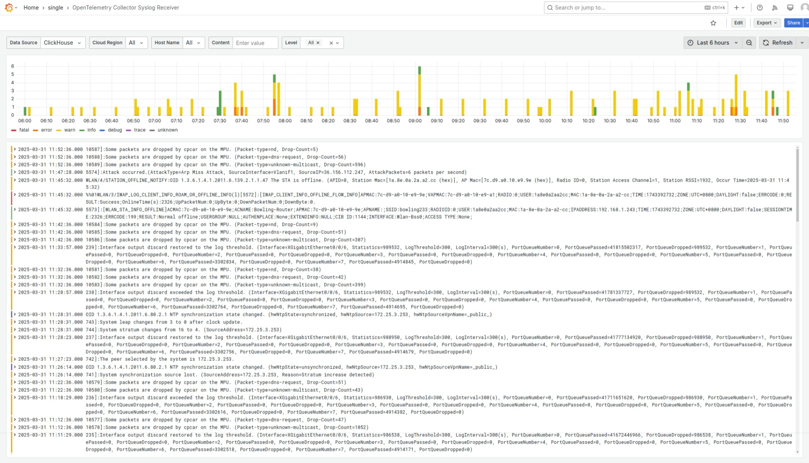
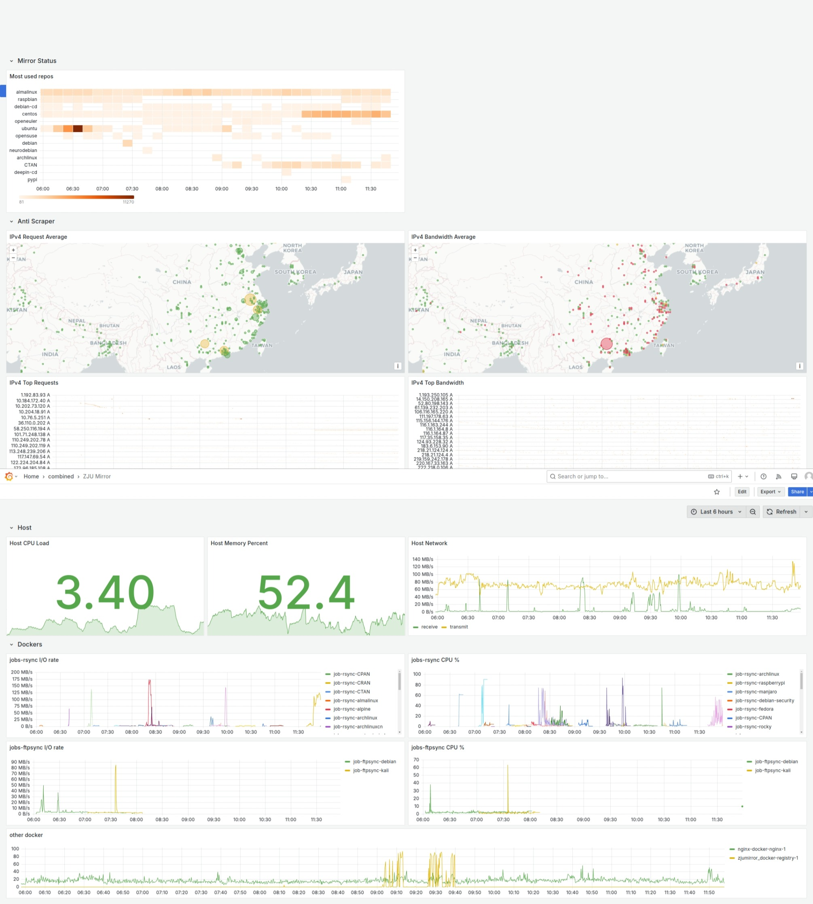

# grafana.clusters.zjusct.io

[中文 README](README_cn.md) | [English README](README.md)

[可观测性 - ZJUSCT OpenDocs](https://docs.zjusct.io/operation/observability/)

本仓库是 ZJUSCT 可观测性系统的配置文件。

## Demo

| pdu          | container      | netflow        | trace          |
| ------------ | -------------- | -------------- | -------------- |
|  |  |  |  |

| cluster      | hostmetrics    | syslog         | mirror |
| ------------ | -------------- | -------------- | -------------- |
|  |  |  |  |

## Todo List

- To be done
    - [ ] Grafana Provision Alerts
- Pending
    - [ ] InfluxDB Exporter
    - [ ] Journald 属性处理：Wait for [journald - Consider parsing more known fields from logs · Issue #7298 · open-telemetry/opentelemetry-collector-contrib](https://github.com/open-telemetry/opentelemetry-collector-contrib/issues/7298).

## 技术选型

We ❤️ Open Source

| 层次 | 组件 |
| --- | --- |
| 数据采集 | [OpenTelemetry Collector](https://github.com/open-telemetry/opentelemetry-collector) |
| 数据存储 | [ClickHouse](https://github.com/ClickHouse/ClickHouse)、[InfluxDB](https://github.com/influxdata/influxdb)、[Prometheus](https://github.com/prometheus/prometheus) |
| 数据分析、可视化和告警 | [Grafana](https://github.com/grafana/grafana) |

系统整体设计遵循 KISS（Keep It Simple, Stupid）原则，简化层次间交互的复杂度，降低系统维护的难度。

## 数据状态

为了方便运维管理，系统的状态应由仓库中的配置文件完全决定，Docker 是无状态的。需要持久化的数据使用 Docker Volume 存储在本地。

- 配置文件：能够使用 Git 管理的配置文件，通常是简单的文本，存储在本仓库中。依靠这些配置文件，我们只需要克隆仓库并 `docker compose up` 就能够快速部署整个系统，开箱即用。

    部分服务将配置保存到数据库中，比如 Grafana，它使用内置的 SQLite 3 存储配置、用户、仪表盘等数据。即使如此，它也提供了 [Provisioning](https://grafana.com/docs/grafana/latest/administration/provisioning/) 功能，可以通过配置文件初始化各项配置。InfluxDB 更加极端，其自动生成 token 的机制导致配置文件无法完全决定状态。

- 数据库：服务的数据库需要持久化存储，Docker 官方建议使用 Volume 来存储数据库这类写入密集型的数据。

    > Use volumes for write-heavy workloads: Volumes provide the best and most predictable performance for write-heavy workloads. This is because they bypass the storage driver and do not incur any of the potential overheads introduced by thin provisioning and copy-on-write. Volumes have other benefits, such as allowing you to share data among containers and persisting even when no running container is using them.

    为了做到开箱即用，`compose.yml` 中的 Volume 均使用相对路径，Git 仓库保留 `database` 的空文件夹结构。

## 安全

区分四种访问范围：

| 区域 | 信任度 | 暴露的服务 |
| --- | --- | --- |
| Docker 内部、宿主机 | 受 Docker Engine 管理的通信，完全信任 | 所有 |
| 集群内部 | 安全状态良好，无需 TLS 加密 | 部分无认证和弱认证的服务，如 syslog、snmp |
| 校内网络 | 需要 TLS 加密，需要认证 | 仅 otel-collector 和 Grafana |
| 公网 | 阻断 | 无 |

认证 Token 托管在集群 VaultWarden 中。在 `compose.yml` 中设置为环境变量，通过 `get_credential.sh` 脚本生成 `.env` 文件，由 Docker Compose 读取。`.env` 文件不应当提交到 Git 仓库中。

## 细节

### OpenTelemetry

Collector 部署为 **Agent + Gateway 模式**。在这种模式下，agent 尽可能只负责采集数据，更多的转换和处理逻辑交给 gateway。**资源属性（Resource Attributes）** 用于标识产生数据的实体，由不同层级的 Collector 附加。通过资源属性划分数据来源的层级结构，有利于在 Grafana 中对数据进行分析。

```mermaid
flowchart TD
 subgraph s1["cloud.region"]
    n8["Infrastructure"]
    n1(["agent"])
    subgraph s3["host.name"]
     n7(["agent"])
     n6["service.name"]
    end
    subgraph s2["host.name"]
     n5["service.name"]
     n4(["agent"])
     n2["service.name"]
    end
 end
 n3(["gateway"])
 n5 --> n4
 n2 --> n4
 n6 --> n7
 n7 --> n1
 n4 --> n1(["gateway"])
 n1(["gateway(cluster)"]) --> n3(["gateway(final)"])
 n8["Infrastructure"] --> n1
```

下面是基于 Semantic Conventions 1.28.0 的在 ZJUSCT 可观测性系统中的资源属性及其来源：

- 节点 agent

    - 节点自身的资源属性

        | 资源属性 | 来源 | 备注 |
        | --- | --- | --- |
        | [节点 `host.name`](https://opentelemetry.io/docs/specs/semconv/resource/host/) 和 [系统 `os.*`](https://opentelemetry.io/docs/specs/semconv/resource/os/) | `resourcedetector` | 在流水线中**自动添加** |

    - 节点上运行的服务大致可以分为两类：进程和容器。

    | 资源属性 | 来源 | 备注 |
    | --- | --- | --- |
    | [进程和运行时 `process.*`](https://opentelemetry.io/docs/specs/semconv/resource/process/) | 不强制要求 | - |
    | [服务 `service.name`](https://opentelemetry.io/docs/specs/semconv/resource/#service) | `journaldreceiver` | **使用 Operator 提取** `SYSLOG_IDENTIFIER` 字段 |
    | | `filelogreceiver` | **使用 Operator 添加**。一般情况下手动添加（文件内很少再包含服务名） |
    | [容器 `container.name`](https://opentelemetry.io/docs/specs/semconv/resource/container/) | `dockerstatsreceiver` | **自动添加** |
    | | `filelogreceiver` | **使用 Operator 提取** Docker JSON 日志中的字段，需要修改 Docker `deamon.json` |

- 集群 gateway

    | 资源属性 | 来源 | 备注 |
    | --- | --- | --- |
    | [集群 `cloud.region`](https://opentelemetry.io/docs/specs/semconv/resource/cloud/) | 在流水线中**手动添加** | 目前 OTel 并未规定真正意义上的“集群”资源属性，因此暂借云服务信息 `cloud.*` 代替。 在简单跨集群部署的情况下可能没有单独的集群 gateway，此时需要 agent 中添加 `cloud.region`。 |
    | [设备 `device.*`](https://opentelemetry.io/docs/specs/semconv/resource/device/) | - | 我们主要使用设备属性表示基础设施（路由器、交换机、智能 PDU 等），和节点有所区分。 - `device.id` - `device.type` |
    | | `syslogreceiver` | **使用 Operator 提取** `hostname` 字段。 |

除了上述资源属性和基本的 JSON 等格式解析，agent 尽可能不进行其他处理。这样既方便部署（更改主要发生在 gateway），也能够保持 agent 的轻量化，减少边缘侧资源消耗。

### Grafana

我们基于上述的数据源、资源属性和 OpenTelemetry 语义规范，制作了一系列的 Grafana 仪表盘，存放于 [`config/grafana/provisioning/dashboards`](config/grafana/provisioning/dashboards) 目录下：

- `zjusct/single`：为单个种类的数据（比如某个 Receiver 和某个存储后端的搭配）制作的 panel 集合，方便 dashboard 取用组合。
- `zjusct/combined`：多种数据源组合的仪表盘，有更加具体的应用场景。

因为 Grafana 数据无持久化，移除 Grafana Docker 时应当注意备份仪表盘。我们使用 [esnet/gdg: Grafana Dashboard Manager](https://github.com/esnet/gdg) 进行仪表盘批量备份。

有很多站点也提供了公开的仪表盘，我们参考了其中的一些设计：

- [Sentry Software](https://hws-demo.sentrysoftware.com/dashboards)

## 代码风格

- 使用 EditorConfig 插件。你可以参考 [.editorconfig](.editorconfig) 文件。
- SQL 使用 VSCode SQLTools 插件格式化。
